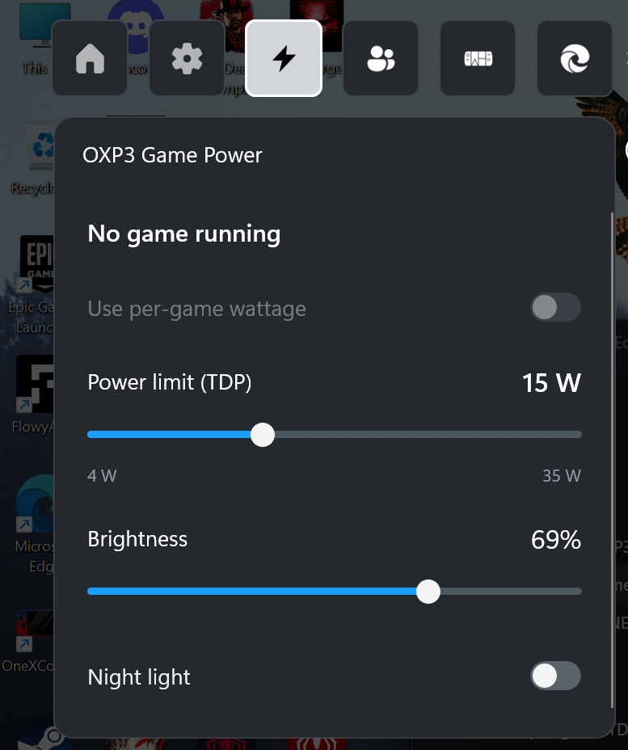

# OXP3 Game Power

Per-game TDP, brightness, and Night light in a controller-friendly Xbox Game Bar widget for the Intel ONEXPLAYER 3.

We built this because ONEXConsole's TDP controls are awkward to use while playing, and the ONEXPLAYER 3's Xbox fullscreen experience lacks quick brightness and Night light controls.

**Alpha · Windows 11 x64 · ONEXConsole 0.10.3-fix2**

This app is in alpha. If you run into trouble, [open an issue](https://github.com/mirana21/oxp-game-bar/issues/new) with what happened and any error message. You can uninstall it using the [removal steps below](#update-or-remove).

## Install

1. Download the ZIP from [Releases](https://github.com/mirana21/oxp-game-bar/releases) and extract it.
2. Run **Setup.exe** and choose **Install / Repair**.
3. Open Xbox Game Bar → **Widgets** → **OXP3 Game Power**.

## Update or remove

To update, run **Setup.exe** and choose **Install / Repair**.

To remove, choose **Remove** in Setup or uninstall **OXP3 Game Power** from Windows Installed apps. Uninstalling restores normal ONEXConsole startup. Saved wattages are retained for reinstall.

